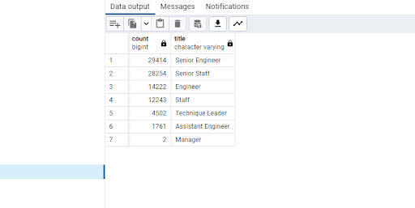
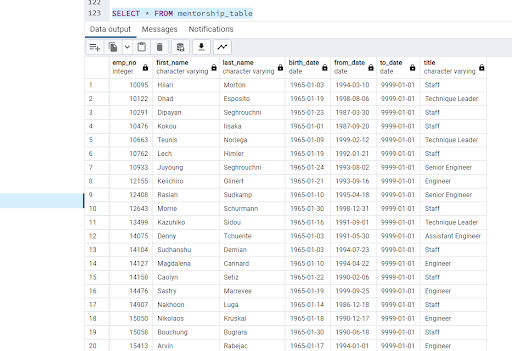

# **Overview of the Analysis**

 The purpose of this analysis is to create a “Retirement Titles” and a “Mentorship-Eligibility” table in order to determine the number of retiring employees per title, and identify employees who are eligible to participate in a mentorship program.

## **Results**
From the image below, we can see the count of employees by job title. The total is 90,398. Of that 90,398, we can see that there are two senior titles that make up a large portion of the total. Senior Engineer and Senior Staff comprise 57,668 or 63.7% of the total. Given this, we can conclude that there is a large number of employees of retirement status. 

Below is the Mentorship Eligibility table. The list is comprised of employees who qualify for mentorship roles and can be identified by their senior status under “title”. 

### **Summary**
 The upcoming “silver tsunami” refers to the 64% of current employees that are retirement eligible. This will provide a large number of mentors. Given this, the company will need to begin a large hiring process to continue operations whilst a large number of the company is retiring. A large number of retirement-eligible employees will help with this process as long as there are new individuals ready to begin the mentorship training process.   
